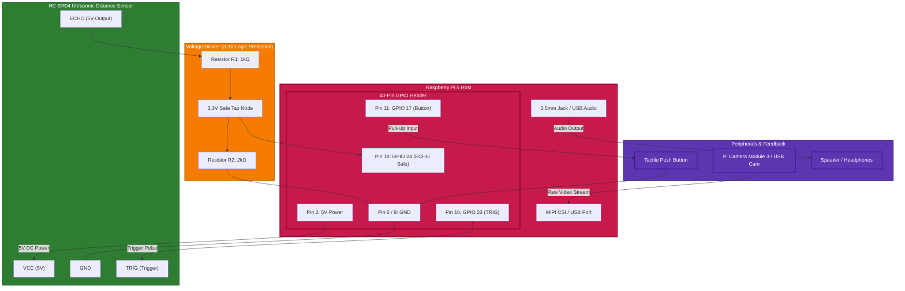

# Real-Time Edge AI Object Detection & Assistive Vision

A real-time object detection and smart vision assistant engineered for **Raspberry Pi 5** using a CPU-optimized **YOLOv8** architecture (no dedicated NPU or AI HAT required).

[](https://www.python.org/)
[]()
[]()
[](https://github.com/rootnode-rebels/object-detection/releases/latest)
[-success.svg)](https://github.com/rootnode-rebels/object-detection/releases/tag/v1.1.0)

---

## 📥 Downloads for Windows Clients (No Python Required)

Clients and testers can download and run the standalone application without needing Python or manual setup:

* 📦 **[Direct Download: `SmartVisionAssistant_Standalone.exe`](https://github.com/rootnode-rebels/object-detection/releases/download/v1.1.0/SmartVisionAssistant_Standalone.exe)** *(~114 MB single self-extracting executable)*
* 🗜️ **[Direct Download: `SmartVisionAssistant-Windows.zip`](https://github.com/rootnode-rebels/object-detection/releases/download/v1.1.0/SmartVisionAssistant-Windows.zip)** *(Portable ZIP with launcher and quickstart guide)*
* 🏷️ **[View GitHub Release v1.1.0](https://github.com/rootnode-rebels/object-detection/releases/tag/v1.1.0)**

---

## 🚀 Key Features

* **CPU-Optimized YOLOv8 Inference**: Runs lightweight YOLOv8 ONNX via OpenCV DNN with ARM NEON acceleration, achieving ~15-20 FPS directly on the Raspberry Pi 5 CPU.
* **92 Assistive Classes with Multi-Sector Spatial Feedback**: Detects navigation hazards and everyday objects with precise spatial localization across **Left**, **Middle**, and **Right** zones with natural prioritized voice feedback.
* **Instant Sector Hotkey Queries**: Query targeted zones instantly with dedicated triggers (`[L]` Left, `[M]` Middle, `[R]` Right, or `[SPACE]` for full overview).
* **Buffer-Free High-Speed Video Pipeline**: Threaded camera stream eliminates OpenCV internal frame buffer delay, guaranteeing zero-latency live vision analysis.
* **Proximity & Manual Triggers**:
  * HC-SR04 ultrasonic sensor continuously monitors for obstacles closer than 1.0 meter.
  * Tactile push button enables instant on-demand voice queries.
* **Non-Blocking Text-to-Speech**: Non-blocking audio alerts (`espeak` on Linux/Pi, native SAPI on Windows, `say` on macOS) without freezing the video stream.
* **Real-Time Telemetry HUD**: Live onscreen overlay displaying current FPS, CPU load %, distance reading, sector bounding boxes, and vocal transcripts.
* **Hardware Benchmark Tool**: Built-in benchmarking tool to measure pure inference, spatial post-processing, sustained FPS, CPU load, and SoC temperatures.

---

## 📊 System Specifications

| Component | Specification |
|---|---|
| **Host System** | Raspberry Pi 5 (Quad-core ARM Cortex-A76 @ 2.4 GHz) |
| **Deep Learning Model** | YOLOv8n ONNX (80 COCO classes / Custom 92 Assistive Vision classes) |
| **Inference Engine** | OpenCV DNN (CPU Backend with ARM NEON SIMD) |
| **Resolution Modes** | `320x320` (~15-20 FPS fast mode) / `640x640` (high accuracy mode) |
| **Proximity Sensor** | HC-SR04 Ultrasonic Distance Sensor |
| **Manual Trigger** | Push button with internal pull-up |
| **Audio Feedback** | Cross-platform TTS (`espeak` on Linux/Pi, SAPI on Windows, `say` on macOS) |

---

## 🔌 Hardware Connections & Wiring Graph

The setup connects the HC-SR04 ultrasonic sensor, tactile push button, camera, and speaker directly to the Raspberry Pi 5.

### Hardware Connection Graph



---

### Pinout & Wiring Table

| Raspberry Pi 5 Pin | Header Label | Connects To | Wire / Role | Notes |
|---|---|---|---|---|
| **Pin 2** | `5V Power` | HC-SR04 `VCC` | Power (Red) | Supplies 5V required by HC-SR04 |
| **Pin 6 / 9** | `GND` | HC-SR04 `GND`, Button Pin 2, Divider `GND` | Ground (Black) | Common ground reference |
| **Pin 16** | `GPIO 23` | HC-SR04 `TRIG` | Signal (Yellow/Orange) | Sends $10\mu\text{s}$ ultrasonic pulse |
| **Pin 18** | `GPIO 24` | Center node of Voltage Divider ($1\text{k}\Omega / 2\text{k}\Omega$) | Signal (Green) | Stepped-down 3.3V safe Echo input |
| **Pin 11** | `GPIO 17` | Push Button Terminal 1 | Signal (Blue) | Internal pull-up enabled in software |
| **CSI / USB** | `CAM / USB 3.0`| Camera Module 3 or USB Webcam | Video In | Live camera stream |
| **3.5mm / USB**| `Audio Jack` | Mini Speaker / Amplified Speaker | Audio Out | Spoken voice alerts via `espeak` |

> [!CAUTION]
> **Protecting Raspberry Pi 5 3.3V GPIO Pins**:
> The HC-SR04 sensor outputs a **5V pulse** on its `ECHO` pin. Connecting this directly to the Pi's GPIO 24 can damage the processor's GPIO bank.
> Always use a **voltage divider**:
>
> $$V_{\text{out}} = 5\text{V} \times \left(\frac{2000\,\Omega}{1000\,\Omega + 2000\,\Omega}\right) = 3.33\text{V}$$
>
> * Connect `ECHO` $\rightarrow$ $1\text{k}\Omega$ resistor ($R_1$).
> * Connect the other end of $R_1$ to `GPIO 24` and to a $2\text{k}\Omega$ resistor ($R_2$).
> * Connect the other end of $R_2$ to `GND`.

---

## 🔄 End-to-End System Workflow

```mermaid
flowchart TD
    subgraph Initialization ["1. System Boot & Initialization"]
        INIT_START(["System Start"]) --> MODEL_INIT["Auto-Detect & Load Model<br/>(92-Class Assistive / COCO-80 ONNX)"]
        MODEL_INIT --> CAM_INIT["Start ThreadedCameraStream Background Thread"]
        CAM_INIT --> SENSOR_INIT["Initialize GPIO: HC-SR04 & Tactile Button"]
        SENSOR_INIT --> READY_VOICE["Speak: AI vision system ready<br/>(Non-blocking cross-platform TTS)"]
    end

    subgraph Video_Inference ["2. Continuous Video & CPU Inference Pipeline"]
        READY_VOICE --> FRAME_LOOP["Read Frame from Buffer-Free Stream"]
        FRAME_LOOP --> BLOB_NORM["Normalize Blob (320x320 / 640x640)"]
        BLOB_NORM --> CPU_FORWARD["OpenCV DNN Forward Pass (ARM NEON / SIMD)"]
        CPU_FORWARD --> NMS_FILTER["Vectorized NMS Candidate Extraction"]
        NMS_FILTER --> SPATIAL_PARTITION["Multi-Sector Spatial Partitioning<br/>Left (<35%) | Middle (35-65%) | Right (>65%)"]
    end

    subgraph Trigger_Eval ["3. Proximity & Trigger Evaluation"]
        SPATIAL_PARTITION --> POLL_SENSORS["Poll HC-SR04 Distance & Button / Sector Hotkeys"]
        POLL_SENSORS --> CHECK_TRIGGER{"Trigger Condition Met?<br/>Obstacle < 1.0m OR Button / Hotkey Pressed<br/>AND Cooldown > 3.0s"}
    end

    subgraph Audio_Feedback ["4. Prioritized Spatial Audio Alerts"]
        CHECK_TRIGGER -- Yes --> FORMAT_SPEECH["Construct Prioritized Spatial Announcement<br/>(format_spatial_announcement)"]
        FORMAT_SPEECH --> PRIORITY_DIR{"Direct Path (Middle) Obstacle?"}
        PRIORITY_DIR -- Yes --> ANNOUNCE_MID["Announce High-Priority Middle Hazard First<br/>'Directly ahead: [object] at [dist]m'"]
        PRIORITY_DIR -- No / Next --> ANNOUNCE_SIDES["Announce Flanking Objects<br/>'To your left: [item], on your right: [item]'"]
        ANNOUNCE_MID --> TTS_ASYNC["Non-Blocking Voice Synthesis<br/>(espeak / Windows SAPI / macOS say)"]
        ANNOUNCE_SIDES --> TTS_ASYNC
        TTS_ASYNC --> RESET_COOLDOWN["Reset 3.0s Cooldown Timer"]
    end

    subgraph Telemetry_HUD ["5. Real-Time Telemetry & Sector HUD"]
        CHECK_TRIGGER -- No --> DRAW_HUD
        RESET_COOLDOWN --> DRAW_HUD["Draw Sector Divider Lines & Color-Coded Bounding Boxes<br/>(Middle: Orange/Red | Left: Yellow | Right: Green)"]
        DRAW_HUD --> RENDER_STATS["Render Telemetry HUD (FPS, CPU %, Distance, Sector Status)"]
        RENDER_STATS --> LOOP_CONT{"Next Frame?"}
        LOOP_CONT -- Yes --> FRAME_LOOP
    end

    subgraph Teardown ["6. Safe System Shutdown"]
        LOOP_CONT -.->|"SIGINT / Ctrl+C / [Q]"| STOP_STREAM["Stop Camera Stream"]
        STOP_STREAM --> RELEASE_DNN["Release OpenCV DNN Engine"]
        RELEASE_DNN --> CLOSE_SENSORS["Close GPIO Handles & Terminate TTS"]
        CLOSE_SENSORS --> EXIT_DONE(["System Safely Halted"])
    end
```



---

## ⚡ Installation & Quick Start

### Option A: Windows Standalone App (Zero Python Required)
For clients and users who want to run the application immediately without installing Python or any libraries:

1. Go to the project root and double-click:
   * **`run_exe.bat`** (or open `dist\SmartVisionAssistant\SmartVisionAssistant.exe`)
2. The standalone app launches with the pre-compiled YOLOv8 92-class model, real-time spatial vision HUD, and native spoken navigation audio alerts out of the box.

---

### Option B: Local PC Simulation via Python (Windows / Mac / Linux)
If running from source code:

1. **Install Modules (1-Click for Windows):**
   * Double-click **`install_modules.bat`** to automatically download and install all required modules (`opencv-python`, `numpy`, `pywin32`, etc.).
   * Or run manually: `pip install -r requirements.txt`

2. **1-Click Launchers (Windows):**
   * **`run_pc_demo.bat`** : Automatically checks/installs dependencies and launches the full webcam + 92-class AI simulator with real-time HUD and audio.
   * **`run_benchmark.bat`** : Runs a 100-frame hardware & AI inference benchmark.
   * **`run_web_simulator.bat`** : Opens the interactive browser-based hardware simulator.

3. **Manual Command:**
   ```bash
   python simulate_pc.py --model model_files/yolov8_assistive_92.onnx --classes classes.txt --resolution 320
   ```
   *Controls during PC simulation:*
   * `[SPACE]` : Full spatial voice query across all sectors (Middle, Left, Right)
   * `[L]` : Voice query **Left** sector only
   * `[M]` : Voice query **Middle** (direct path) sector only
   * `[R]` : Voice query **Right** sector only
   * `[W]` / `[UP]` : Move closer to obstacle (decreases ultrasonic distance)
   * `[S]` / `[DOWN]` : Move farther from obstacle (increases ultrasonic distance)
   * `[A]` : Toggle Auto-walk radar oscillation mode
   * `[Q]` / `[ESC]` : Exit simulation

4. **Interactive Hardware Web Simulator & Prototype Showcase:**
   - **Dedicated Repository:** [rootnode-rebels/ai-object-detection-simulation](https://github.com/rootnode-rebels/ai-object-detection-simulation)
   - **Live Online Demo:** [https://rootnode-rebels.github.io/ai-object-detection-simulation/](https://rootnode-rebels.github.io/ai-object-detection-simulation/)
   - Open `simulation.html` or `prototype_showcase.html` locally in any web browser to interactively test the ultrasonic radar, push button, spatial sector HUD, and voice synthesis in a GUI environment.

---

### Option C: Physical Raspberry Pi 5 Deployment

#### 1. Install System Dependencies
On Raspberry Pi OS (Bookworm):
```bash
sudo apt update && sudo apt install python3-opencv python3-gpiozero python3-psutil python3-numpy espeak -y
```

#### 2. Install Python Packages
```bash
pip install -r requirements.txt --break-system-packages
```

#### 3. Run the Smart Assistant

**Standard Mode (Auto-detects 92-class model or COCO baseline at ~15-20 FPS on Pi 5 CPU):**
```bash
python3 smart_assistant.py --resolution 320
```

**Explicit Model & Custom Classes Selection:**
```bash
python3 smart_assistant.py --model model_files/yolov8_assistive_92.onnx --classes classes.txt --resolution 320
```

**Headless Mode (for battery-powered wearable use):**
```bash
python3 smart_assistant.py --headless
```

#### 4. Run Benchmark Tool
```bash
python3 benchmark_performance.py --frames 100 --resolution 320
```

---

## 🎯 92 Supported Assistive Classes

The custom-trained assistive model detects 92 essential indoor, outdoor, and hazard objects:

* **Pedestrian & Navigation Hazards**: `staircase`, `door`, `pothole`, `manhole`, `speed breaker`, `pedestrian crossing`, `road barrier`, `road divider`, `traffic cone`, `drain`, `fence`, `gate`, `construction material`, `rock`, `stone`
* **Vehicles & Street Mobility**: `person`, `auto-rickshaw`, `car`, `bus`, `truck`, `motorcycle`, `scooter`, `bicycle`, `street light`, `traffic light`, `fire hydrant`
* **Indoor Furniture & Landmarks**: `chair`, `bench`, `table`, `desk`, `bed`, `sofa`, `cabinet`, `cupboard`, `shelf`, `switchboard`, `electrical socket`, `sink`, `toilet`
* **Everyday Objects**: `water bottle`, `backpack`, `mobile phone`, `laptop`, `book`, `cup`, `glass`, `plate`, `bowl`, `spoon`, `fork`

---

## 📁 Repository Structure

```text
├── dist/SmartVisionAssistant/  # Standalone Windows executable distribution
├── run_exe.bat                 # 1-Click launcher for standalone executable
├── install_modules.bat         # 1-Click module installer for clients
├── run_pc_demo.bat             # 1-Click Windows PC simulation launcher (auto-installs missing modules)
├── run_benchmark.bat           # 1-Click Windows AI & CPU benchmark tool
├── run_web_simulator.bat       # 1-Click launcher for interactive web simulation
├── simulate_pc.py              # Native PC simulation & CV demo with speech
├── simulation.html             # Interactive browser-based hardware simulator
├── smart_assistant.py          # Main real-time Raspberry Pi 5 assistant & HUD
├── yolo_detector.py            # CPU-optimized YOLOv8 inference & spatial engine
├── build_assistive_model.py    # Zero-shot CLIP encoder for custom classes
├── train_custom_yolo.py        # Custom YOLOv8 training and ONNX export pipeline
├── classes.txt                 # List of 92 assistive object classes
├── benchmark_performance.py    # Performance & thermal benchmarking tool
├── SETUP_GUIDE.md              # Raspberry Pi 5 hardware wiring & setup guide
├── requirements.txt            # Python dependencies
├── README.md                   # Project documentation & wiring diagrams
└── .gitignore                  # Git ignore rules
```

---

## 📄 License
MIT License

